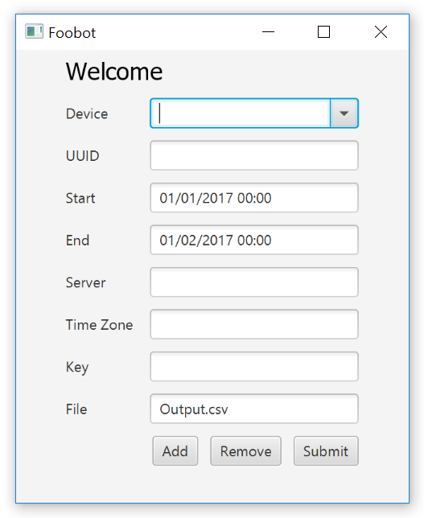

# Foobot

S small JavaFX program I hacked together for a friend of mine. It sends a GET request to a foobot.io server based on the specifications and retrieves the the appropriate JSON with sensor data. The JSON is then converted to a CSV file. The process creates a new column with time converted to a human readable format and as well checks for missing entries, where it inserts a blank line with only time data.

His version had a list of preset devices built into it as well as options to add new devices and remove the ones no longer used. It saves data in a .config file on exit and then retrieves it on load.

## User interface

